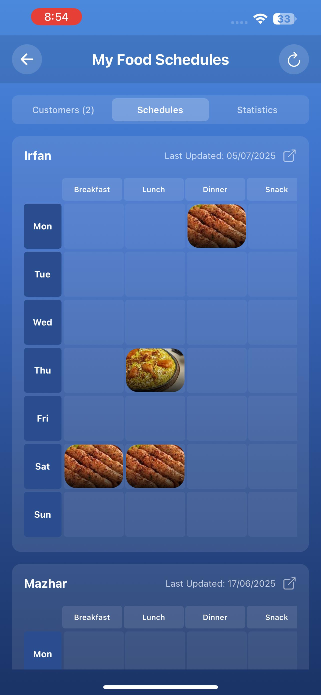

# Smart Ordering System for University 

[](https://reactnative.dev/)
[](https://nodejs.org/)
[](https://www.mongodb.com/)
[](LICENSE)

> 

Welcome to the **Smart Ordering System for Comsats Dhaba**!  
This is a modern, feature-rich food ordering app designed for university campuses, enabling students, faculty, and staff to place, track, and receive food orders in the most efficient and user-friendly manner.

---

## 🚀 Features

- 📱 **Cross-Platform Mobile App:** Built with React Native for Android (Expo).
- 🔒 **Secure Authentication:** User and admin registration, login, and profile management.
- 🍽️ **Menu Management:** Dynamic menu with detailed descriptions, pricing, and customization.
- 🛒 **Order Placement:** Easy order selection, customization, and confirmation.
- 🚚 **Delivery Management:** Real-time delivery tracking and on-campus delivery options.
- 💳 **Digital Payments:** Seamless and secure payment processing (cashless).
- 💬 **Feedback & Ratings:** Users can rate their orders and provide feedback.
- 🏆 **Rewards & Loyalty:** Points-based program for users and performance-based rewards for staff.
- 👨‍🍳 **Dhaba Manager Dashboard:** Manage orders, kitchen, delivery staff, and view real-time sales.
- 📊 **Analytics Dashboard:** Order analytics for operational insights.
- 🛡️ **Admin Panel:** User, order, and feedback management.

---

## 📸 Screenshots

## 📸 Screenshots

<div align="center">

<table>
  <tr>
    <td align="center">
      
    </td>
    <td align="center">
      
    </td>
  </tr>
  <tr>
    <td align="center">
      
    </td>
    <td align="center">
      
    </td>
  </tr>
  <tr>
    <td align="center">
      
    </td>
    <td align="center">
      
    </td>
  </tr>
  <tr>
    <td align="center">
      
    </td>
    <td align="center">
      
    </td>
  </tr>
  <tr>
    <td align="center" colspan="2">
      
    </td>
  </tr>
</table>

</div>
---

## 🎬 Demo Video

> 
>
> [Watch Demo on YouTube](https://youtu.be/cJXcXq6g7Bw)

---

## ⚙️ Tech Stack

| Layer     | Technology         |
|-----------|-------------------|
| Frontend  | React Native (Expo)|
| Backend   | Node.js, Express.js|
| Database  | MongoDB           |
| State     | Redux             |
| Auth      | Firebase          |
| Design    | Figma             |
| Testing   | Postman, Jest     |

---

## 🧩 Modules Overview

1. **User Authentication** – Registration, login, password recovery, profiles.
2. **Menu Management** – Add/Edit/Delete menu items by dhaba managers.
3. **Order Placement** – Select, customize, and confirm orders.
4. **Payment Processing** – Secure online payments.
5. **Delivery Management** – Assign drivers, track orders.
6. **Feedback & Rating** – Collect user reviews and suggestions.
7. **Dhaba Manager Module** – Manage kitchen, assign delivery, staff performance.
8. **Rewards System** – Points and rewards for users and staff.
9. **Admin Panel** – Overall management and reporting.

---

## 🏫 Why This Project?

- Reduces wait times and eliminates queues
- Enables cashless transactions
- Supports on-campus delivery to specific locations
- Gathers user feedback for continuous improvement
- Boosts operational efficiency for dhaba staff

---

## 🏁 Getting Started

### Prerequisites

- Node.js & npm
- MongoDB
- Expo CLI (`npm install -g expo-cli`)

### Installation

1. **Clone the repository**
   ```bash
   git clone https://github.com/your-username/smart-dhaba-ordering.git
   cd smart-dhaba-ordering
   ```
2. **Install backend dependencies**
   ```bash
   cd backend
   npm install
   ```
3. **Install frontend dependencies**
   ```bash
   cd ../frontend
   npm install
   ```
4. **Set up environment variables**
   - Create a `.env` file in both `backend` and `frontend` folders with appropriate settings (see `.env.example`).

5. **Start the backend**
   ```bash
   npm start
   ```
6. **Start the frontend (Expo)**
   ```bash
   expo start
   ```

---

## 📚 Documentation

- [Project Overview](#smart-ordering-system-for-comsats-dhaba)
- [Features](#-features)
- [Modules](#-modules-overview)
- [Tech Stack](#-tech-stack)
- [Getting Started](#-getting-started)
- [Screenshots & Demo](#-screenshots)
- [Contributing](#-contributing)
- [License](#-license)

---

## 🤝 Contributing

We welcome contributions!  
Please open issues or pull requests for bug fixes, improvements, or new features.

---

## 📄 License

This project is [MIT licensed](LICENSE).

---

## 🙋‍♂️ Contact

For queries, feedback, or collaboration:  
[Muhammad Masood Khan](mailto:masoodkhan5933@gmail.com)  
<div class="badge-base LI-profile-badge" data-locale="en_US" data-size="medium" data-theme="light" data-type="HORIZONTAL" data-vanity="m-masood-k" data-version="v1"><a class="badge-base__link LI-simple-link" href="https://pk.linkedin.com/in/m-masood-k?trk=profile-badge">Muhammad Masood Khan</a></div>
              

---

> _Stay tuned for updates, new features, and live deployment!_
